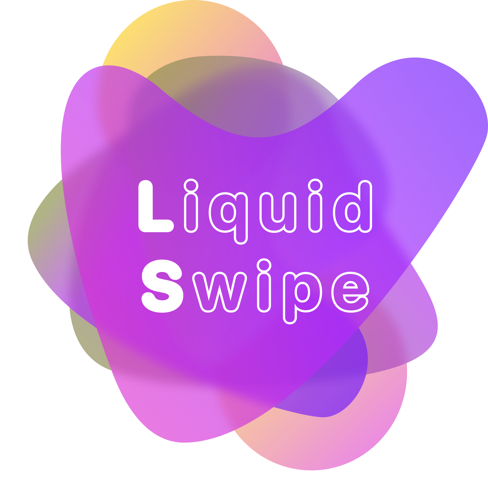
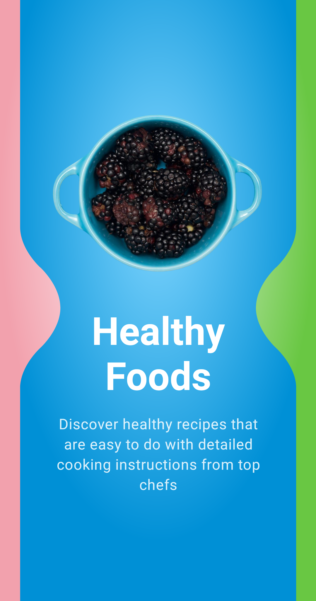

<h1 align="center">
  
</h1>

<h1 align="center">React Native Liquid Swipe</h1>
<h3 align="center">Telas com transições baseadas no efeito de Liquid Swipe</h3>

  

## ✨ Tecnologias

Esse projeto foi desenvolvido com as seguintes tecnologias:

-  [React Native](https://reactnative.dev/)
-  [Typescript](https://www.typescriptlang.org/)
-  [Expo](https://expo.io/)

## 💻 Projeto

Aplicativo realizado para a demonstração do fluid design aplicado a uma tela inicial.

## 🚀 Como executar

-  Clone o repositório
-  Instale as dependências com `yarn`
-  Inicie seu app com `npx react-native run-android` ou `npx react-native run-ios`

---

Projeto concluido com ♥ by PitzTech com a tutoria de [William Candillon](https://github.com/wcandillon)

  
  &nbsp;&nbsp;&nbsp;&nbsp;
  
  &nbsp;&nbsp;&nbsp;&nbsp;
  

